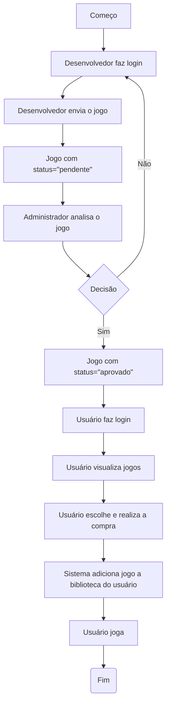
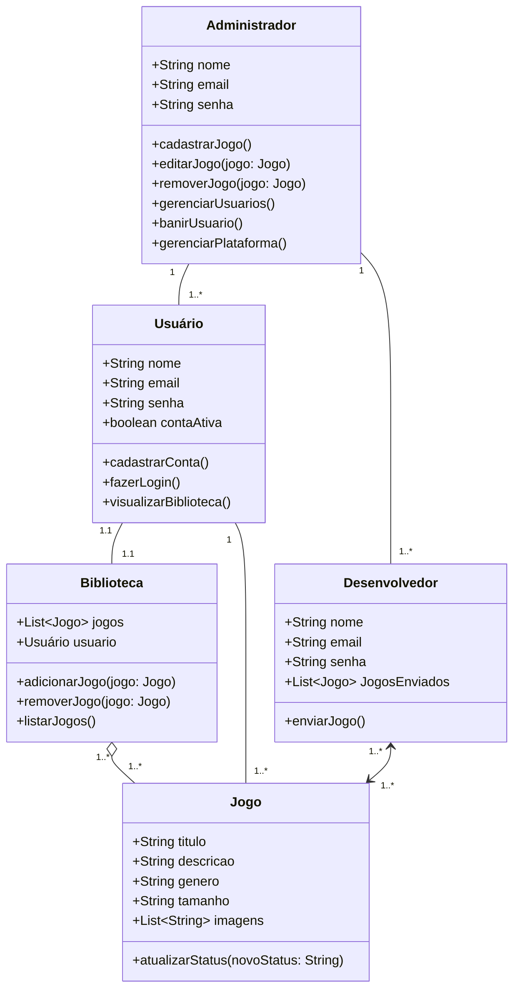

# Plataforma de Jogos e Sociabilidade – Mythic

## Identificação do problema
Com a crescente popularização do mundo dos jogos, é comum que muitas pessoas ainda não tenham acesso a um computador decente para o consumo destes mesmos. O mythic entra buscando ser uma alternativa para estás pessoas, com o desenvolvimento de uma aplicação web onde será possível jogar no próprio navegador com jogos mais leves, com acesso a socialização entre os usuários, para gerar a sensação de realmente estar incluído neste mundo que está em constante crescimento. Também tem como objetivo a divulgação de trabalhos de desenvolvedores iniciantes, podendo colocar seus próprios jogos no site, e demonstrando suas habilidades, conseguindo assim oportunidades de trabalho em studios maiores, ou reconhecimento para seus próprios trabalhos.

## Objetivos Gerais
Desenvolvimento de uma aplicação web com possibilidade de jogar e socializar com outros usuários, com foco principalmente de usuários com computadores mais fracos.

## Objetivos Específicos
- Desenvolvimento de aplicação de alta usabilidade e otimização
- Temática atraente a todos os públicos para facilitar o acesso
- Design de interação fácil
- Disponibilidade de diversos tipos de jogos
- Divulgação de trabalhos de desenvolvedores

## Público-Alvo
- Usuário (usuários finais)
- Criadores (usuários intermediários)
- Admin (usuários iniciais)

## Levantamento de Requisitos do Projeto

### Requisitos Funcionais
- RF01: Permitir cadastro e login via e-mail. 
- RF02: Criar e personalizar perfil (nome, foto, biografia, status, avatar). 
- RF03: Exibir lista de jogos com categorias. 
- RF04: Implementar sistema de amigos. 
- RF05: Oferecer chats com amigos. 

## Recusos do Projeto

### Tecnológicos
- Framework de Desenvolvimento Next/React
- Linguagem de Programação: TypeScript
- Banco de Dados: Relacional (MySQL)
- VScode
- Figma

### Pessoal
- Equipe de Colaboradores

## Diagrama de Fluxo

## Diagrama de Classe

## Diagrama de Uso
