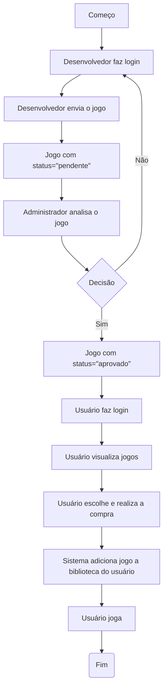
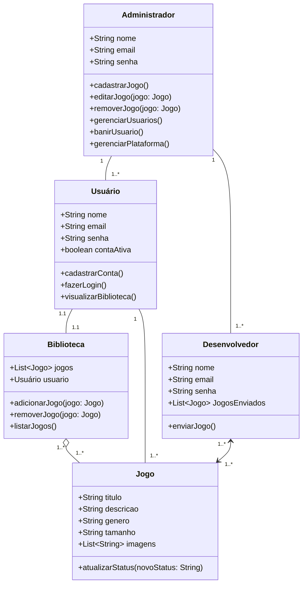
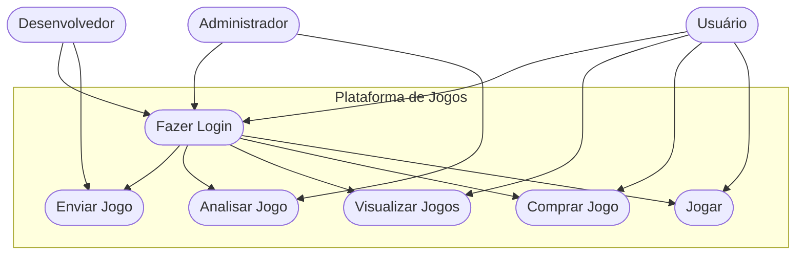

# Plataforma de Jogos e Sociabilidade – Mythic

## Identificação do problema
Com a crescente popularização do mundo dos jogos, é comum que muitas pessoas ainda não tenham acesso a computadores de alto desempenho para consumir esse tipo de entretenimento. O Mythic surge como uma alternativa inclusiva, oferecendo uma aplicação web onde será possível jogar diretamente no navegador, com títulos mais leves, acessíveis e otimizados.

Entretanto, o Mythic vai além do público jogador: ele busca fortalecer o ecossistema de desenvolvedores independentes, oferecendo um espaço de visibilidade, colaboração e crescimento profissional. A proposta é unir jogadores e criadores em um mesmo ambiente digital, permitindo que novos talentos mostrem seus projetos, recebam feedback e ampliem sua presença no mercado nacional.

O mercado de jogos digitais tem se expandido exponencialmente em escala global e nacional, consolidando-se como uma das maiores indústrias de entretenimento do mundo. Em 2024, estimava-se a existência de cerca de 1,86 bilhão de jogadores de PC em todo o planeta, movimentando mais de US$ 60 bilhões em hardware e software voltado ao público gamer.
Apesar dessa força, o setor ainda enfrenta um desafio significativo: a desigualdade de acesso e oportunidades — tanto para jogadores com máquinas modestas quanto para desenvolvedores que não dispõem de estrutura, visibilidade ou apoio para publicar seus jogos.

No Brasil, essa realidade é especialmente marcante. De acordo com a Pesquisa Game Brasil (PGB) 2025, 82,8 % da população brasileira consome jogos digitais.
Entre as plataformas mais utilizadas, o computador (desktop ou notebook) representa 22,6 % da preferência, ficando atrás apenas dos smartphones (48,8 %).
Esse dado mostra que ainda há uma base expressiva de jogadores em PC, embora muitos utilizem máquinas simples, com limitação para rodar títulos mais exigentes.
Além disso, 64,8 % dos jogadores pertencem à classe média, o que reforça a necessidade de soluções acessíveis e otimizadas — tanto para jogar quanto para criar.

O Brasil é hoje um dos maiores mercados de games do mundo, movimentando cerca de R$ 13 bilhões por ano, com projeção de dobrar de tamanho até 2026, ultrapassando US$ 2,8 bilhões em receita.
O país já conta com mais de 103 milhões de jogadores, consolidando-se como o maior público gamer da América Latina.

Essa força se reflete também no número crescente de estúdios e desenvolvedores independentes brasileiros, que vêm conquistando reconhecimento dentro e fora do país.
Eventos como a Brasil Game Show (BGS) — maior feira de games da América Latina, ou a Gamescom Latam, voltado a jogos independentes, e o SBGames, que conecta academia e indústria, demonstram o potencial criativo e inovador do cenário nacional.
No entanto, a maioria das grandes plataformas continua voltada a estúdios consolidados e jogos de alto custo de produção, deixando pouco espaço para criadores iniciantes.

É justamente nesse contexto que o Mythic se diferencia.
Sua proposta é democratizar a criação e o acesso aos jogos, oferecendo um ambiente unificado onde desenvolvedores podem publicar, divulgar e testar seus projetos, enquanto jogadores encontram experiências leves, gratuitas e acessíveis diretamente no navegador.

A plataforma também incentivará a interação entre criadores e comunidade, estimulando feedbacks, colaborações e aprendizado coletivo. Assim, o Mythic busca se tornar um ponto de encontro entre o talento independente e o público gamer brasileiro, ajudando a revelar novos nomes e fortalecer o desenvolvimento nacional.

Dessa forma, o Mythic não apenas amplia o acesso a jogos para usuários com hardware limitado, mas também constrói um ecossistema de incentivo à criação nacional, impulsionando a economia criativa e contribuindo para a consolidação do Brasil como um polo relevante no cenário mundial de desenvolvimento de jogos.

## Objetivos Gerais
Desenvolvimento de uma aplicação web com possibilidade de jogar e socializar com outros usuários, com foco principalmente de usuários com computadores mais fracos.

## Objetivos Específicos
- Desenvolvimento de aplicação de alta usabilidade e otimização
- Temática atraente a todos os públicos para facilitar o acesso
- Design de interação fácil
- Disponibilidade de diversos tipos de jogos
- Divulgação de trabalhos de desenvolvedores

## Público-Alvo
- Usuário (usuários finais)
- Criadores (usuários intermediários)
- Admin (usuários iniciais)

## Levantamento de Requisitos do Projeto

### Requisitos Funcionais
- RF01: Permitir cadastro e login via e-mail.
- RF02: Criar e personalizar perfil (nome, foto, status, avatar).
- RF03: Exibir lista de jogos com categorias.
- RF04: Implementar sistema de amigos.
- RF05: Oferecer chats com amigos.
- RF06: Permitir que desenvolvedores enviem seus próprios jogos para análise.
- RF07: Permitir que o administrador aprove ou recuse jogos enviados.
- RF08: Disponibilizar jogos aprovados para os usuários jogarem diretamente no navegador.
- RF09: Permitir que usuários adicionem jogos à biblioteca pessoal.
- RF10: Permitir comentários e avaliações em jogos publicados.

### Requisitos Não Funcionais
- RNF01: O sistema deve ser leve e otimizado para funcionar em computadores de baixo desempenho.
- RNF02: A plataforma deve ser responsiva, adaptando-se a diferentes tamanhos de tela (PC, tablet e celular).
- RNF03: O tempo de carregamento das páginas não deve ultrapassar 3 segundos em conexões comuns.
- RNF04: Os dados de usuários e desenvolvedores devem ser protegidos com autenticação segura e criptografia.
- RNF05: A interface deve ser intuitiva e de fácil navegação, permitindo que qualquer usuário utilize o sistema sem treinamento prévio.

## Recusos do Projeto

### Tecnológicos
- Framework de Desenvolvimento Next/React
- Linguagem de Programação: TypeScript
- Banco de Dados: Relacional (MySQL)
- VScode
- Figma

### Pessoal
- Equipe de Colaboradores

## Equipe de Desenvolvimento

| Nome | Função |
|------|--------|
| João Cardoso | Programador |
| Guilherme Xavir | Programador |
| Eduardo Silva Barbosa | Prototipação e Esboço |
| Enzo Paralupi | Prototipação e Esboço |
| Kaun Santos | Prototipação e Esboço |
| Derick Correia | Documentação |
| Enzo Donizetti | Documentação |

##  Cronograma Resumido (Exemplo)
| Etapa | Descrição | Duração |
|-------|------------|----------|
| Planejamento | Definição do escopo e requisitos | 2 semanas |
| Design e Protótipos | Criação das telas no Figma | 3 semanas |
| Desenvolvimento | Implementação do front e back-end | 6 semanas |
| Testes e Correções | Ajustes e otimização de performance | 2 semanas |
| Entrega Final | Implantação e documentação | 1 semana |

## Diagrama de Fluxo

## Diagrama de Classe

## Diagrama de Uso

# Figma
- https://www.figma.com/design/RWTzYGELO0kp2GblTdFi6W/Untitled?node-id=0-1&t=94FZdp9vr8wEpFeC-1

# Fontes
- https://www.pesquisagamebrasil.com.br
- https://newzoo.com
- https://abragames.org
- https://www.bigfestival.com.br
- https://www.sbgames.org
