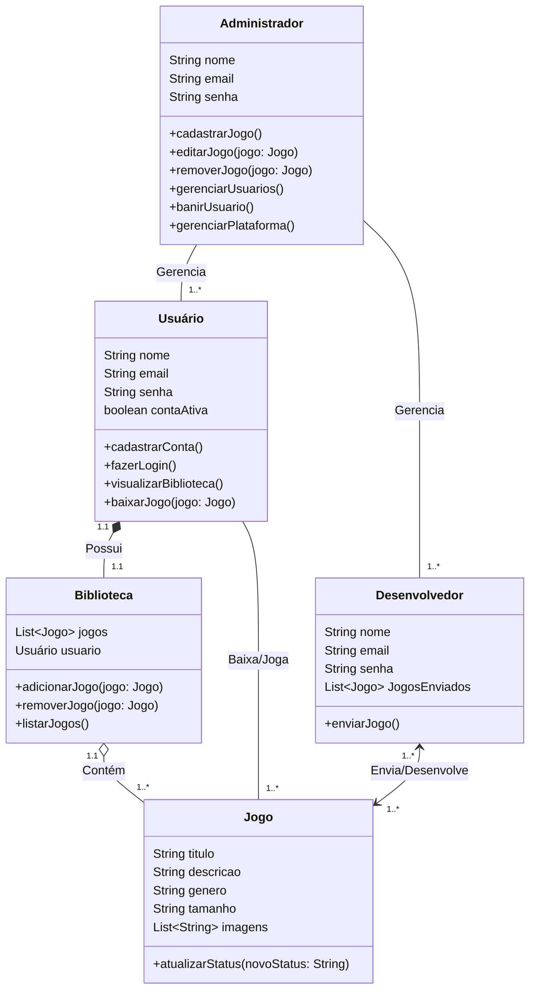

# Plataforma de Jogos e Sociabilidade – Mythic

## Identificação do problema
Com a crescente popularização do mundo dos jogos, é comum que muitas pessoas ainda não tenham acesso a um computador decente para o consumo destes mesmos. O mythic entra buscando ser uma alternativa para estás pessoas, com o desenvolvimento de uma aplicação web onde será possível jogar no próprio navegador com jogos mais leves, com acesso a socialização entre os usuários, para gerar a sensação de realmente estar incluído neste mundo que está em constante crescimento. Também tem como objetivo a divulgação de trabalhos de desenvolvedores iniciantes, podendo colocar seus próprios jogos no site, e demonstrando suas habilidades, conseguindo assim oportunidades de trabalho em studios maiores, ou reconhecimento para seus próprios trabalhos.

## Objetivos Gerais
Desenvolvimento de uma aplicação web com possibilidade de jogar e socializar com outros usuários, com foco principalmente de usuários com computadores mais fracos.

## Objetivos Específicos
- Desenvolvimento de aplicação de alta usabilidade e otimização
- Temática atraente a todos os públicos para facilitar o acesso
- Design de interação fácil
- Disponibilidade de diversos tipos de jogos
- Divulgação de trabalhos de desenvolvedores

## Público-Alvo
- Usuário (usuários finais)
- Criadores (usuários intermediários)
- Admin (usuários iniciais)

## Levantamento de Requisitos do Projeto

### Requisitos Funcionais
- RF01: Permitir cadastro e login via e-mail. 
- RF02: Criar e personalizar perfil (nome, foto, biografia, status, avatar). 
- RF03: Exibir lista de jogos com categorias. 
- RF04: Implementar sistema de amigos. 
- RF05: Oferecer chats com amigos. 

## Recusos do Projeto

### Tecnológicos
- Framework de Desenvolvimento Next/React
- Linguagem de Programação: TypeScript
- Banco de Dados: Relacional (MySQL)
- VScode
- Figma

### Pessoal
- Equipe de Colaboradores

## Diagrama de Fluxo
```mermaid
graph TD
    subgraph Fluxo Desenvolvedor/Admin
        A(Começo) --> B[Desenvolvedor faz login]
        B --> C[Desenvolvedor envia o jogo]
        C --> D[Jogo com status="pendente"]
        D --> E[Administrador analisa o jogo]
        E --> F{Decisão}
        F -- Não --> B
    end

    subgraph Fluxo Usuário
        G[Jogo com status="aprovado"] --> H[Usuário faz login]
        H --> I[Usuário visualiza jogos]
        I --> J[Usuário escolhe e realiza a compra]
        J --> K[Sistema adiciona jogo a biblioteca do usuário]
        K --> L[Usuário baixa e joga]
        L --> M(Fim)
    end

    %% Conexão entre os fluxos
    F -- Sim --> G
```
## Diagrama de Classe

## Diagrama de Uso
```mermaid
useCaseDiagram
    %% Definição dos Atores
    actor Usuário
    actor Desenvolvedor
    actor Administrador

    %% Delimitação do Sistema
    rectangle "Plataforma de Jogos" {
        
        %% Casos de Uso do Usuário
        Usuário -- (Cadastrar Conta)
        Usuário -- (Fazer Login)
        Usuário -- (Navegar na Loja)
        Usuário -- (Comprar Jogo)
        Usuário -- (Acessar Biblioteca)
        Usuário -- (Baixar Jogo)
        
        %% Casos de Uso do Desenvolvedor
        Desenvolvedor -- (Fazer Login)
        Desenvolvedor -- (Enviar Jogo)
        
        %% Casos de Uso do Administrador
        Administrador -- (Fazer Login)
        Administrador -- (Analisar Jogo Enviado)
        Administrador -- (Gerenciar Usuários)
        Administrador -- (Gerenciar Jogos)
    }

    %% Relações entre Casos de Uso (baseado no fluxo)
    (Comprar Jogo) ..> (Navegar na Loja) : <<extend>>
    (Baixar Jogo) ..> (Acessar Biblioteca) : <<include>>
    (Analisar Jogo Enviado) ..> (Enviar Jogo) : <<extend>>
    
    %% Relação de 'include' para Login (necessário para a maioria das ações)
    (Navegar na Loja) ..> (Fazer Login) : <<include>>
    (Comprar Jogo) ..> (Fazer Login) : <<include>>
    (Acessar Biblioteca) ..> (Fazer Login) : <<include>>
    (Enviar Jogo) ..> (Fazer Login) : <<include>>
    (Analisar Jogo Enviado) ..> (Fazer Login) : <<include>>
    (Gerenciar Usuários) ..> (Fazer Login) : <<include>>
    (Gerenciar Jogos) ..> (Fazer Login) : <<include>>
```